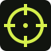
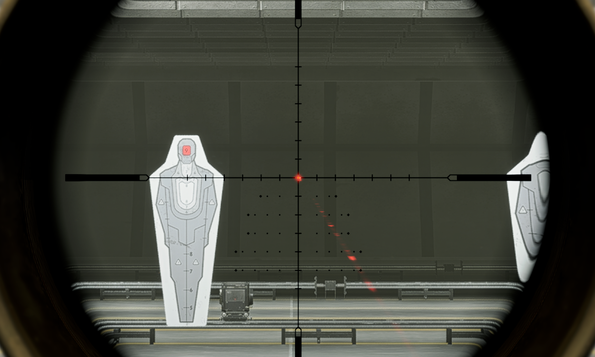

<p align="center">
  
</p>

<h1 align="center">Battlefield 6 Scopes</h1>

<p align="center">Pick two sights. See exactly what changes.</p>

<p align="center">
  <strong><a href="https://landmine-1252.github.io/battlefield-6-scopes/">OPEN THE SCOPE COMPARISON →</a></strong>
</p>

<p align="center">
  
  
  
</p>

A quick visual reference for Battlefield 6 optics. Find a scope by name, zoom, or attachment cost, then compare its actual sight picture with another one.

## What it does

- Compares two scopes side by side, with a slider, or with press-and-hold
- Creates shareable links that remember both scopes, zoom levels, and comparison mode
- Filters by magnification, attachment points, and sniper-only optics
- Switches between compact, card, and image-first layouts
- Marks scopes that reach 6× or higher as sniper-rifle only (`SR`)

No backend and no separate database—the catalog is built from the PNG filenames in [`images/`](images/).

## Add or fix a scope

Corrections and clean replacement captures are welcome. Match the default firing-range position used by the existing images so comparisons stay lined up.

For a 3440×1440 source screenshot, use this crop:

| | Pixels |
| --- | ---: |
| X | 1095 |
| Y | 345 |
| Width | 1250 |
| Height | 750 |

That puts the crop dead center at `1720,720` and leaves enough room for the larger optics.

### File names

```text
ID-scope_name_ZOOMx[POINTS].png  # fixed zoom
ID-scope_name-ZOOMx[POINTS].png  # selectable/variable zoom
ID-scope_name[POINTS].png        # no zoom in the name
```

Examples:

```text
19-pvq-31_4.00x[10].png
25-mars-f_lpvo-5x[25].png
23-su-230_lpvo-x1[20].png
```

The last underscore means fixed zoom; the last dash means a selectable zoom on a variable scope. Files with the same ID and name are grouped together.

- `ID` only controls organization and sorting. It is not shown on the site.
- Underscores become spaces; hyphens stay visible.
- Put the attachment cost in brackets. If it is missing, the site uses 10 points.
- Add one PNG for every selectable zoom level on a variable scope.
- Sniper-rifle iron sights cost 15 points, so always include `[15]` for those files.

Before opening a pull request, check the scope name, zoom, point cost, and crop in the local site.

## Run it locally

On Windows, double-click `serve-local.bat`, then open <http://localhost:8000>.

Or run:

```bash
npm run manifest
python3 -m http.server 8000
```

Use `npm test` for the parser tests and `npm run build` to create the same clean site directory deployed by GitHub Pages.

Pushes to `main` rebuild the image manifest and deploy the site automatically. If Pages is not enabled on a fork, choose **Settings → Pages → Source → GitHub Actions**.

---

Community-made and not affiliated with EA or Battlefield.
